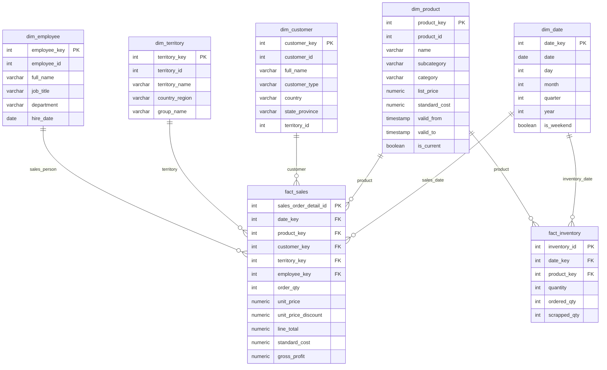

# Thiết Kế Sơ Đồ Cấu Trúc Data Warehouse (Star Schema)
**Vai trò: Data Architect (Thành viên A)**

Dưới đây là sơ đồ Star Schema của hệ thống Data Warehouse. Nó bao gồm 2 bảng sự kiện (`Fact_Sales` và `Fact_Inventory`) cùng với các bảng chiều (`Dim_Date`, `Dim_Product`, `Dim_Customer`, `Dim_Territory`, `Dim_Employee`) kết nối xung quanh.

## Các Quyết Định Thiết Kế (Design Decisions)
1. **Sử dụng Surrogate Keys (`_key` tự tăng)** thay cho Business Keys gốc (`_id`) từ OLTP. Điều này cho phép lưu trữ lịch sử thay đổi (SCD) và cô lập hệ thống DW khỏi các thay đổi cấu trúc bảng ở nguồn.
2. **SCD Type 2 áp dụng cho `Dim_Product`**: `list_price` và `standard_cost` có thể thay đổi. Việc dùng SCD Type 2 đảm bảo phân tích lợi nhuận doanh thu (Margin, Profit) trong quá khứ được tham chiếu chính xác đến giá vốn và giá bán tại thời điểm giao dịch xảy ra.
3. **SCD Type 1 áp dụng cho các Dimension còn lại**: Do yêu cầu dự án không đặt nặng việc phân tích lịch sử thay đổi của khách hàng, nhân viên, hoặc khu vực.
