# Thiết Kế Sơ Đồ Cấu Trúc Data Warehouse (Star Schema)

Dưới đây là sơ đồ Star Schema của hệ thống Data Warehouse: 2 bảng sự kiện (`fact_sales`, `fact_inventory`) với các bảng chiều (`dim_date`, `dim_product`, `dim_customer`, `dim_territory`, `dim_employee`), cùng các bảng ML output và mart layer.

```mermaid
erDiagram
    dim_date {
        int date_key PK
        date date
        int day
        int month
        int quarter
        int year
        boolean is_weekend
    }

    dim_product {
        int product_key PK
        int product_id
        varchar name
        varchar subcategory
        varchar category
        numeric list_price
        numeric standard_cost
        timestamp valid_from
        timestamp valid_to
        boolean is_current
    }

    dim_customer {
        int customer_key PK
        int customer_id
        varchar full_name
        varchar customer_type
        varchar country
        varchar state_province
        int territory_id
        timestamp modified_date
    }

    dim_territory {
        int territory_key PK
        int territory_id
        varchar territory_name
        varchar country_region
        varchar group_name
    }

    dim_employee {
        int employee_key PK
        int employee_id
        varchar full_name
        varchar job_title
        varchar department
        date hire_date
    }

    fact_sales {
        int sales_order_detail_id PK
        int sales_order_id
        int date_key FK
        int product_key FK
        int customer_key FK
        int territory_key FK
        int employee_key FK
        int order_qty
        numeric unit_price
        numeric unit_price_discount
        numeric line_total
        numeric standard_cost
        numeric gross_profit
        timestamp _load_timestamp
    }

    fact_inventory {
        int inventory_id PK
        int date_key FK
        int product_key FK
        int location_id
        int quantity
        timestamp _load_timestamp
    }

    ml_customer_segments {
        int customer_key
        varchar full_name
        int recency_days
        int frequency
        numeric monetary
        int cluster_id
        varchar cluster_label
        numeric silhouette_score
        timestamp _load_timestamp
    }

    ml_inventory_anomaly {
        int product_key
        varchar product_name
        varchar category
        varchar subcategory
        numeric avg_quantity
        numeric std_quantity
        numeric max_quantity
        numeric inventory_value
        numeric units_sold
        numeric days_inventory_outstanding
        boolean anomaly_flag
        numeric anomaly_score
        boolean zero_sales_flag
        timestamp _load_timestamp
    }

    decision_support {
        varchar entity_type
        int entity_key
        varchar signal_type
        varchar priority
        text recommended_action
        text reason
        timestamp _load_timestamp
    }

    mart_kpi_snapshot {
        int snapshot_id PK
        varchar kpi_name
        varchar period_type
        varchar period_key
        date period_start
        date period_end
        numeric value
        varchar dimension
        varchar dimension_value
        int row_count
        timestamp calculated_at
        varchar etl_batch_id
    }

    mart_rfm_snapshot {
        int snapshot_id PK
        varchar period_key
        date period_start
        date period_end
        varchar cluster_label
        int customer_count
        numeric avg_recency
        numeric avg_frequency
        numeric avg_monetary
        numeric total_monetary
        numeric pct_of_total
        timestamp calculated_at
    }

    mart_customer_migration {
        int migration_id PK
        int customer_key
        varchar prev_period_key
        varchar curr_period_key
        varchar prev_cluster
        varchar curr_cluster
        numeric prev_monetary
        numeric curr_monetary
        boolean is_churned
        boolean is_new
        timestamp calculated_at
    }

    mart_inventory_snapshot {
        int snapshot_id PK
        varchar period_key
        date period_start
        date period_end
        int product_key
        numeric avg_quantity
        numeric avg_inventory_value
        numeric avg_dio
        int anomaly_count
        numeric anomaly_score_avg
        timestamp calculated_at
    }

    mart_period_comparison {
        int comparison_id PK
        varchar kpi_name
        varchar curr_period_key
        varchar prev_period_key
        varchar dimension
        varchar dimension_value
        numeric curr_value
        numeric prev_value
        numeric abs_change
        numeric pct_change
        numeric contribution_pct
        boolean is_significant
        numeric p_value
        numeric effect_size
        timestamp calculated_at
    }

    mart_daily_sales_agg {
        int date_key PK
        date date
        int year
        int quarter
        int month
        int order_count
        int item_count
        int total_qty
        numeric revenue
        numeric gross_profit
        int customer_count
        timestamp _load_timestamp
    }

    %% Relationships - Star Schema core
    dim_date ||--o{ fact_sales : "sales_date"
    dim_product ||--o{ fact_sales : "product"
    dim_customer ||--o{ fact_sales : "customer"
    dim_territory ||--o{ fact_sales : "territory"
    dim_employee ||--o{ fact_sales : "sales_person"

    dim_date ||--o{ fact_inventory : "inventory_date"
    dim_product ||--o{ fact_inventory : "product"
```

## Danh sách bảng

| Schema | Bảng | Loại | Số dòng |
|--------|------|------|---------|
| `dw` | `dim_date` | Dimension | 11,323 |
| `dw` | `dim_product` | Dimension (SCD2) | 504 |
| `dw` | `dim_customer` | Dimension | 19,820 |
| `dw` | `dim_territory` | Dimension | 10 |
| `dw` | `dim_employee` | Dimension | 290 |
| `dw` | `fact_sales` | Fact | 121,317 |
| `dw` | `fact_inventory` | Fact | 1,069 |
| `dw` | `ml_customer_segments` | ML Output | 18,669 |
| `dw` | `ml_customer_clustering_metrics` | ML Output | ~6 |
| `dw` | `ml_inventory_anomaly` | ML Output | 432 |
| `dw` | `decision_support` | ML Output | 18,870 |
| `mart` | `kpi_snapshot` | Mart | time-series |
| `mart` | `rfm_snapshot` | Mart | per quarter |
| `mart` | `customer_migration` | Mart | 12,804 |
| `mart` | `period_comparison` | Mart | per period |
| `mart` | `inventory_snapshot` | Mart | per period |
| `mart` | `daily_sales_agg` | Mart | daily |

## Các Quyết Định Thiết Kế

1. **Surrogate Keys (`_key` tự tăng)** thay cho Business Keys gốc (`_id`) từ OLTP — cho phép SCD và cô lập DW khỏi thay đổi cấu trúc nguồn.
2. **SCD Type 2 cho `dim_product`**: `list_price` và `standard_cost` thay đổi theo thời gian, SCD2 đảm bảo phân tích margin/lợi nhuận chính xác đến từng thời điểm giao dịch.
3. **SCD Type 1 cho các dimension còn lại**: không yêu cầu phân tích lịch sử thay đổi của customer/territory/employee.
4. **ML & Mart tables**: ML output lưu trong `dw.*` (kết quả model), mart snapshot lưu trong `mart.*` (KPI time-series phục vụ dashboard).
